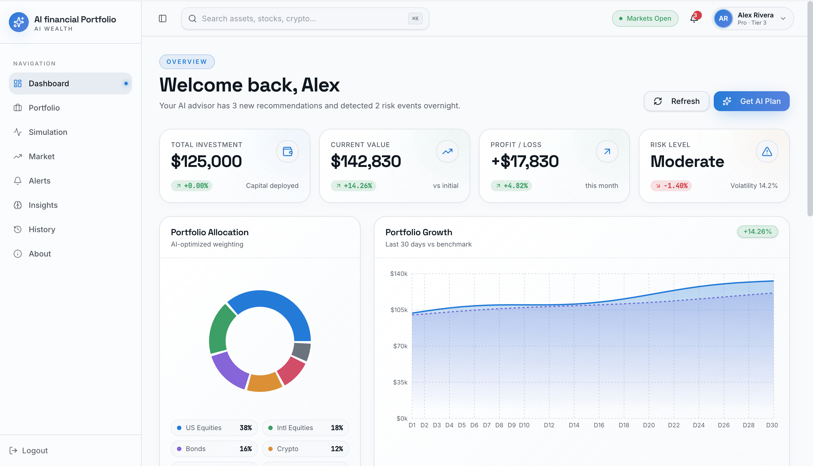

# AI-Financial-Analysis-Portfolio

An AI-powered portfolio management and stock analysis system that helps users analyze market data, optimize investments, and make data-driven financial decisions.

---



## 🚀 Features

* 📊 Market Data Analysis (historical + live)
* 📈 Technical Indicators (RSI, MACD, Moving Averages)
* 🤖 AI-Based Stock Price Prediction
* 💼 Portfolio Optimization (risk vs return)
* 🎲 Monte Carlo Simulation
* 📰 Sentiment Analysis (market insights)
* 🔔 Price Alerts & Risk Monitoring
* 📊 Portfolio Tracking & Comparison
* 🔍 Stock Screener

---

## 🛠️ Tech Stack

* Backend: FastAPI
* Language: Python
* Data Source: yfinance
* Data Processing: Pandas, NumPy
* Machine Learning: Scikit-learn
* Authentication: JWT
* Server: Uvicorn

---

## 🏗️ Project Structure

```
project/
│── app/
│   ├── services/        # Business logic (ML, analytics)
│   ├── models/          # Request/response schemas
│   ├── auth/            # Authentication
│   ├── database/        # DB handling
│   ├── routes/          # API endpoints
│
│── main.py              # Entry point
│── requirements.txt     # Dependencies
│── README.md
```

---

## ⚙️ Installation

### 1. Clone Repository

```bash
git clone https://github.com/your-username/your-repo-name.git
cd your-repo-name
```

### 2. Create Virtual Environment

```bash
python -m venv venv
source venv/bin/activate   # Mac/Linux
venv\Scripts\activate      # Windows
```

### 3. Install Dependencies

```bash
pip install -r requirements.txt
```

### 4. Run Server

```bash
uvicorn main:app --reload
```

---

## 📡 API Endpoints

| Endpoint              | Description               |
| --------------------- | ------------------------- |
| /market/data          | Get historical stock data |
| /market/live          | Live stock price          |
| /portfolio/recommend  | Portfolio optimization    |
| /portfolio/simulate   | Monte Carlo simulation    |
| /ai/predict           | Stock price prediction    |
| /technical/indicators | Technical analysis        |
| /sentiment/analyze    | Sentiment analysis        |
| /portfolio/track      | Track portfolio           |
| /portfolio/compare    | Compare stocks            |
| /screener/run         | Stock screener            |

---

---

## 🧠 How It Works

1. Fetch stock data using yfinance
2. Process data using Pandas & NumPy
3. Apply ML models for prediction
4. Optimize portfolio using financial models
5. Provide insights via API endpoints

---

## 📌 Future Improvements

* Deep learning models (LSTM)
* Real-time streaming (WebSockets)
* UI Dashboard (React)
* Integration with trading APIs

---

## 👨‍💻 Author

Your Name
GitHub: https://github.com/your-username

---

## 📄 License

This project is for educational purposes.
